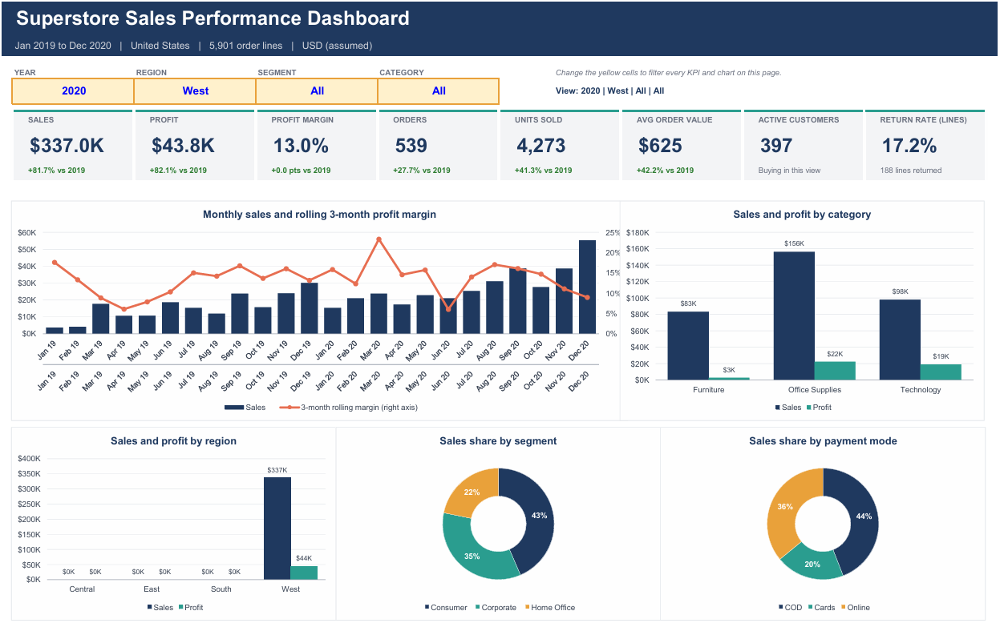

# Superstore Sales Analytics

This repository serves as a flagship demonstration of end-to-end retail analytics. It represents a best-in-class approach to Excel-based data modeling, transforming raw, multi-year datasets into interactive executive dashboards and actionable business intelligence

## Project Visuals & Dashboards

## Business Problem

A US retailer of furniture, office supplies, and technology experienced significant revenue growth but needed to understand the underlying mechanics of that growth. The primary objectives were to determine:

* Which products and regions are driving profitability and which are losing money?
* Why overall profit margins are declining despite rising sales volume?
* How shipping, returns, and seasonality impact the bottom line.
* What strategic steps the business should take next to protect its revenue and optimize margins.

## Dataset Overview

* **Source:** SuperStore_Sales_Dataset.csv
* **Timeframe:** January 1, 2019, to December 31, 2020
* **Scope:** 5,901 order lines, 3,003 unique orders, 773 customers across 49 states.
* **Data Grain:** One row per order line (a specific product within an order).

## Data Cleaning & Transformation

To ensure analytical accuracy, the raw dataset (initially 5,901 rows and 23 columns) underwent rigorous cleaning and structural formatting. For full documentation on the cleaning process, anomaly handling, and data dictionaries.

* **Structural Fixes:** Repaired corrupted headers (e.g., "Row ID+O6G3A1:R6") and removed entirely blank columns.
* **Data Type Conversions:** Converted "Order Date" and "Ship Date" from text strings (DD-MM-YYYY) into true functional Excel dates.
* **Standardization:** Cleaned the "Returns" column by replacing unstructured N/A placeholders and binary flags with standardized "Yes" or "No" values.
* **Anomaly Handling:** Identified and documented data anomalies, such as order lines where profit exceeded sales, multi-name product IDs, and the fact that return data was only tracked in the second year (2020).
* **Feature Engineering:** Created vital helper columns using Excel formulas to enable time-series and cohort analysis, including: *Order Year*, *Quarter*, *Month Start*, *Ship Days*, *Order Flag*, and *Order-Category Flag*.

## Key Insights & Findings

### 1. The "Growth Quality" Challenge

While top-line sales grew by a massive **77%** from 2019 to 2020, bottom-line profit only increased by **14%**. This severe imbalance caused the overall profit margin to plummet from 14.5% down to 9.3%.

### 2. Regional Margin Drops

The erosion of the company's profit margin is heavily concentrated in two regions:

* **Central:** Margin collapsed from 16.5% to 3.4%.
* **South:** Margin dropped from 20.0% to 5.4%.
* *Note:* The East and West regions successfully maintained their margins year-over-year.

### 3. Product Performance Divergence

* **The Profit Engine (Technology):** Generates 52% of the company's total profit from only 30% of total sales (operating at a healthy 19.2% margin). Copiers are particularly lucrative.
* **The Loss Leader (Furniture):** Contributes 29% of sales but only 6% of profit, operating at a razor-thin 2.2% margin. The "Tables" sub-category is actively draining resources, recording a net loss of -$11,092 with 64% of all table orders losing money.
* **Volume Without Value:** Binders saw a 210% increase in sales volume, but profit fell by 25%. Machines transitioned from being a profitable category to operating at a -7.2% margin.

### 4. Geographic Profit Leaks

Volume does not equal profit. 10 out of the 49 states are currently operating at a net loss. The heaviest localized losses occurred in Texas (-$14,078), Illinois (-$9,555), Ohio (-$9,339), and Pennsylvania (-$9,298).

### 5. Returns & Customer Loyalty

* **Returns:** The West region experienced an alarming 17.2% return rate in 2020 (compared to ~4-5% in other regions).
* **Loyalty:** Customer retention is excellent. 87.5% of 2019 customers returned to purchase again in 2020, and the top 20% of the customer base generates nearly half (47.7%) of all sales.

## Strategic Recommendations

1. **Implement Margin Floors:** Report margin alongside sales volume on a weekly basis. Set strict price and discount floors for high-volume but declining-margin categories like Binders and Machines.
2. **Investigate Regional Bleed:** Audit pricing structures, discount allowances, and fulfillment costs specifically in the Central and South regions, as well as the 10 loss-making states (starting with TX and IL).
3. **Restructure Furniture:** Reprice or renegotiate supplier contracts for Tables and Bookcases. If a positive margin cannot be achieved, discontinue the worst-performing product lines.
4. **Audit West Coast Fulfillment:** Launch an immediate investigation into the West region's 17.2% return rate to determine if the root cause is product quality, shipping damage, or regional return policies.
5. **Protect the Core:** Develop a targeted VIP retention program for the top 20% of customers to insulate the 47.7% of revenue they represent.

## Technical Skills Demonstrated

* **Data Cleaning:** Handling nulls, text-to-date conversion, string manipulation.
* **Data Modeling:** Feature engineering, boolean flags, dynamic date bucketing.
* **Advanced Analysis:** Cohort retention analysis, profit/loss geographic mapping, margin calculations.
* **Reporting:** Executive dashboarding, data storytelling, and translating raw metrics into actionable business strategy.

